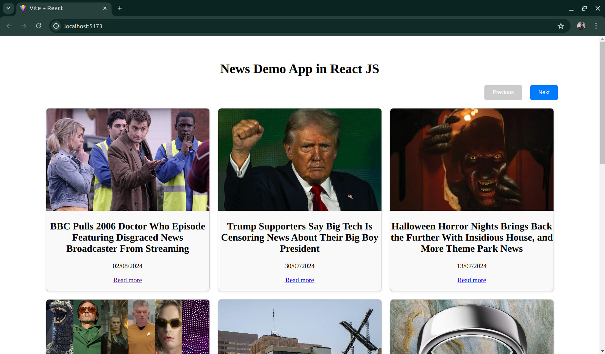

# NewsApp - React

**News Application - React JS** is basically a sample news web app which is built to demonstrate the React JS connectivity with Node JS Server

## Screenshots 

## About
It loads the news article using [news api](https://newsapi.org/) with pagination.

## Architecture

## Future Scope

## Contributing and reporting issues
You can to contribute in this repository. Just make pull request.
I appreciate any question or comment.
